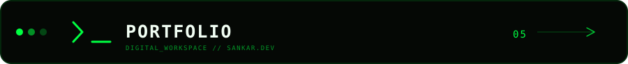

<div align="center">


<br/>

<br/> <br/>
<p align="center">
  
<br/><br/>


<br/>
<table>
<tr>
<td align="center">

</td>
</tr>
</table>

</div>


<p align="center">
  
</p>

<div align="center">


<br/>
</div>


<p align="center">
  <a href="https://progsankar.vercel.app/">
    
  </a>
</p>
``` [❶](code://python)

<p align="center">
  
</p>


<p align="center">
  
</p>

<div align="center">


<br/><br/>

<p align="center">
  
</p>

</div>


<p align="center">
  
</p>

<div align="center">

<table>
<tr>
<td>

<a href="https://github.com/sankar-prog">

</a>

</td>
<td>

<a href="https://www.linkedin.com/in/sankar-arumugam-489b76366">

</a>

</td>
<td>

<a href="https://x.com/ffsankar007">

</a>

</td>
</tr>

<tr>
<td>

<a href="https://www.instagram.com/_.sanxxr">

</a>

</td>
<td>

<a href="mailto:devo.sankar@gmail.com">

</a>

</td>
</tr>
</table>

</div>


